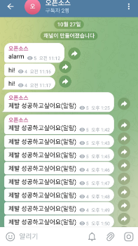
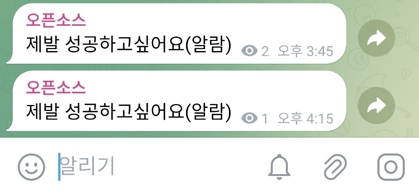

# 텔레그램 알람봇 과제 2번 오픈소스 201911977_이세훈


# 분할 성공 사진1

1분단위로 실행한 사진

# 분할 성공 사진2

30분단위로 실행한 사진

## 실행 방법 (python=3.7.16)
1. 레포지토리 복제해주세요

2. 설치해주세요
   ```bash
   pip3 install -r requirements.txt
   ```
3. tele.py에서 자신의 텔레그램 토큰과 이름 등을 수정해주세요
4. tele.py 실행!
